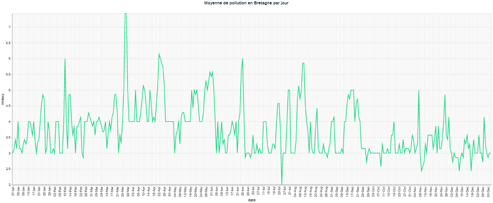
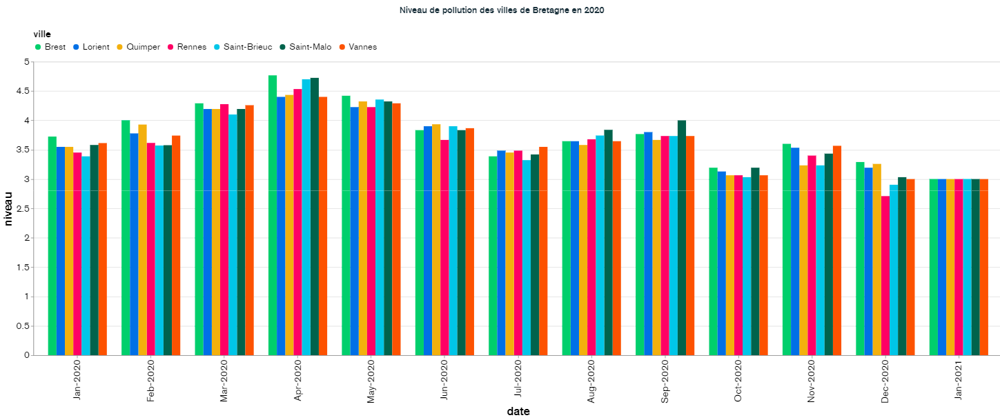
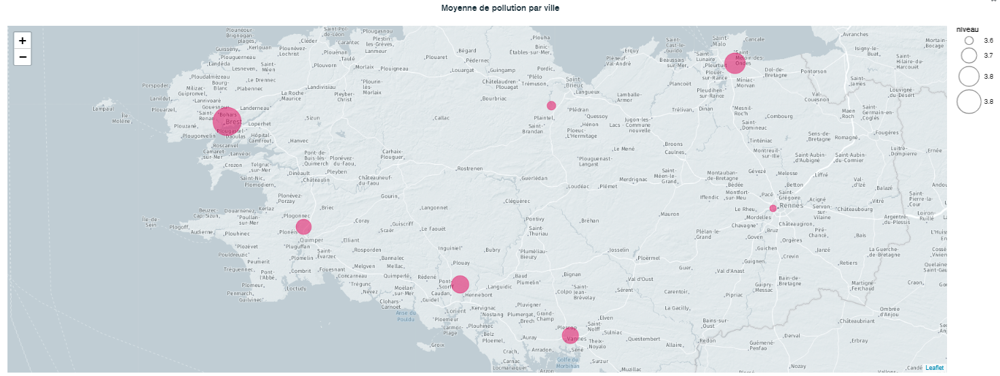

# Qualité de l'air en Bretagne en 2020

L'objectif est de traiter les données de qualité de l'air en Bretagne sur l'année 2020 et d'en évaluer l'impact de la COVID-19 sur la polution de l'air.

Pour ce faire, nous utiliserons l'API de `data.airbreizh.asso.fr` pour récupérer les données

## Récolter les données
L'API nous permet de récupérer l'ensemble des données. J'ai fais le choix de uniquement:
- L'aglomération concernée
- La date du prélèvement
- Le niveau de pollution
- Les coordonnées géographique 

Je les ai ensuite enregistré dans un json afin de les exporter vers MongoDB.

## Interprétation des résultats

Nous pouvons voir sur ce graphique le niveau moyen de pollutiondes 7 villes présentes dans ce jeu de données. Nous pouvons observer une légère hausse de mars à juin qui correspond au confinement.

Ce graphique permet d'observer le niveau moyen mensuel pour chaque aglomération. Il nous permet aussi d'observer l'augmentation lié au confinement.

Cette map affiche le niveau moyen de chaque aglomération grace aux coordonnées géographiques. Nous pouvons donc observer que Brest et Saint-Malo sont les aglomérations avec le niveau de pollution le plus élevé en moyenne sur l'année 2020.

## Conclusion
Nous pouvons donc affirmer que la COVID-19 et plus particulièrement le confinement a eu un impact négatif sur la qualité de l'air en Bretagne. Ceci peut s'éxpliquer par le fait que les Bretons ont du chauffé leurs logements d'avantage pendant le premier confinement.
